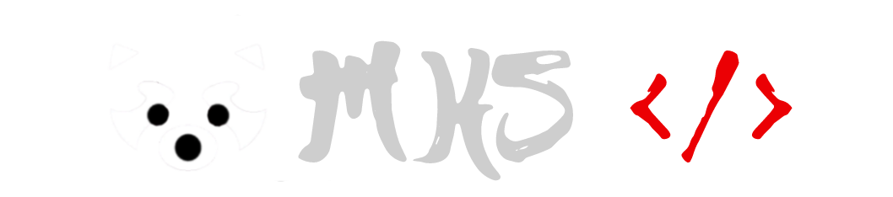

[](https://git.io/typing-svg)

<h3 align="center">
    <br>
    Back-end Developer
</h3>

Backend engineer in the making. I like systems that have to actually work.

I spend most of my time building things that live behind the UI - APIs, services, data pipelines, proxies, and the occasional system that has no business being as complicated as I made it.

Lately, I've been especially interested in Go, distributed systems, networking, concurrency, databases, and backend architecture.

I learn best by building, breaking, profiling, and rebuilding things.

### A few things I've learned

> The fastest system is often the one doing less work.

> Concurrency gets interesting when you stop thinking only about threads and start thinking about shared state.

> You understand a system much better once you've had to debug one of its failure modes.

### My Usual Toolbox

<table>
  <tr>
    <td align="center" width="180"><strong>Languages</strong></td>
    <td>
      
      
      
      
    </td>
  </tr>
  <tr>
    <td align="center"><strong>Backend & Systems</strong></td>
    <td>
      
      
      
      
      
      <!--  -->
      
    </td>
  </tr>
  <tr>
    <td align="center"><strong>Data</strong></td>
    <td>
      
      
      
      
    </td>
  </tr>
  <tr>
    <td align="center"><strong>Tools & Platforms</strong></td>
    <td>
      
      
      
      <!--  -->
      
      
    </td>
  </tr>
</table>

### A little about me

I'm pursuing a B.Tech in Computer Science & Engineering at Techno Main Salt Lake, Kolkata.

Outside of programming, I spend some of my time studying and trading forex. I enjoy the analytical side of it - understanding market behaviour, testing ideas, and thinking about risk and probabilities.

I also do competitive programming from time to time, mostly because solving a problem in an empty editor is a nice change of pace from debugging one in a real codebase.


### My Programming Language Stats
<!--START_SECTION:waka-->

```rust
From: 01 March 2026 - To: 30 August 2026

Total Time: 74 hrs 46 mins

Go                15 hrs 7 mins         >>>>>--------------------   18.67 %
Markdown          14 hrs 37 mins        >>>>>--------------------   18.05 %
Python            9 hrs 52 mins         >>>----------------------   12.19 %
Other             6 hrs 17 mins         >>-----------------------   07.75 %
```

<!--END_SECTION:waka-->

[](https://u8views.com/github/kayden-vs)

<h2 align="center"> Find Me </h2>
<div align="center">
  <a href = "mailto:connect.rohitroy@gmail.com"></a>
  <a href="https://www.linkedin.com/in/rohit-roy-vs/" target="_blank"></a> 
  </a>
 </div>
</p>


